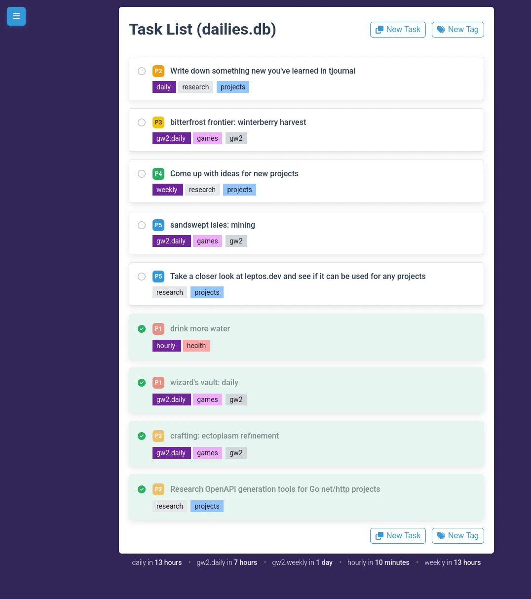

# Dailies

A web-based task tracking application designed for managing daily routines and recurring tasks with automated reset capabilities.



## Overview

Dailies is a modern task management system that helps users track their daily activities, habits, and recurring tasks. The application features automatic task reset functionality based on customizable frequency schedules, allowing users to maintain consistent daily routines without manual intervention.

Key features include:

- **Task Management**: Create, edit, and track completion of daily tasks
- **Smart Scheduling**: Automatic task reset based on cron-style frequency schedules
- **Organization Tools**: Tag-based categorization and priority-based sorting
- **Real-time Updates**: WebSocket integration for live task list updates
- **Responsive Interface**: HTMX-powered frontend for seamless user interactions
- **AI Integration**: Model Context Protocol (MCP) server for AI agent access

## Use Cases

- **MMORPG Activities**: Keep track of daily/weekly/monthly in-game tasks, quests, or resource gathering routines
- **Daily Routines**: Track morning routines, exercise, meditation, or reading habits
- **Work Tasks**: Manage recurring work activities like code reviews, standup preparation, or report generation
- **Health & Wellness**: Monitor daily health activities, medication schedules, or wellness check-ins
- **Personal Development**: Track learning goals, skill practice, or creative activities
- **Household Management**: Organize daily chores, maintenance tasks, or family activities
- **Team Coordination**: Share recurring team tasks with automatic reset cycles

## Technologies

### Backend

- **Go 1.24.6**: Core web services and API
- **GORM**: Database ORM with SQLite support
- **Cron Scheduler**: Automated task reset functionality
- **WebSocket**: Real-time notifications and updates

### Frontend

- **HTMX**: Dynamic HTML interactions without JavaScript frameworks
- **Hyperscript**: Animation and interactivity enhancements
- **HTML Templates**: Server-side rendered components

### Development & Build

- **Webpack**: Asset bundling and optimization
- **Bun**: Package management and frontend tooling
- **Air**: Hot reload development server
- **Docker**: Containerization support
- **Mise-en-place**: Development tasks

### Infrastructure

- **SQLite**: Lightweight embedded database
- **UUID**: Distributed identifier system
- **JSON API**: RESTful API design
- **Embedded Assets**: Self-contained binary deployment

### AI Integration

- **MCP Server**: Model Context Protocol server for AI agent interaction
- **Tool-based API**: 15 specialized tools for task, tag, and frequency management
- **Stdio Transport**: Standard input/output communication with AI agents

## Getting Started

### Development

```bash
# Install dependencies
bun install
mise run dev

# Start development server with hot reload
bun run serve

# Build frontend assets
bun run build
```

### Production

```bash
# Build the application
mise run build

# Run the server
./server --address :9001 --db ~/dailies.db
```

The application will be available at `http://localhost:9001`.

## MCP Integration

The application includes an MCP (Model Context Protocol) server that allows AI agents to interact with your tasks, tags, and frequencies.

### Running the MCP Server

```bash
# Run MCP server (connects to API at localhost:9001 by default)
go run cmd/mcp/main.go

# Connect to different API host
go run cmd/mcp/main.go --host api.example.com:3000
```

### Available MCP Tools

The MCP server provides 15 tools across three categories:

**Task Management:**

- `tasks_list_tasks` - List tasks with filtering and sorting
- `tasks_get_task` - Get task details by ID
- `tasks_create_task` - Create new tasks
- `tasks_update_task` - Update existing tasks
- `tasks_delete_task` - Delete tasks

**Tag Management:**

- `tasks_list_tags` - List all tags
- `tasks_get_tag` - Get tag by ID
- `tasks_create_tag` - Create new tags
- `tasks_update_tag` - Update tag properties
- `tasks_delete_tag` - Delete tags

**Frequency Management:**

- `tasks_list_frequencies` - List frequency schedules
- `tasks_get_frequency` - Get frequency by ID
- `tasks_create_frequency` - Create cron-based schedules
- `tasks_update_frequency` - Update frequency settings
- `tasks_delete_frequency` - Delete frequencies

### Integration with AI Agents

The MCP server enables AI agents to:

- Automatically manage your daily tasks and routines
- Create and organize tasks based on natural language requests
- Set up recurring schedules for habit tracking
- Analyze task completion patterns and suggest optimizations
- Provide intelligent task prioritization and scheduling
